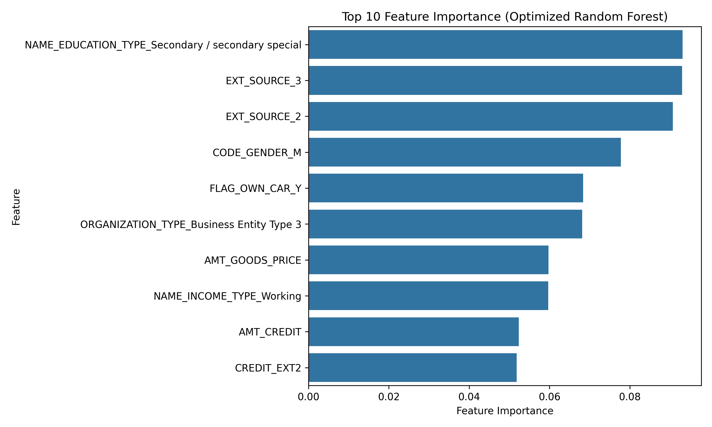
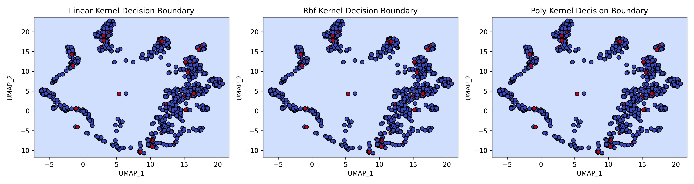

# Credit Risk Prediction with Machine Learning: SVM and Random Forest

## Overview
This project predicts loan default risk using the [Home Credit Default Risk dataset](https://www.kaggle.com/competitions/home-credit-default-risk). It explores Support Vector Machines (SVM) with kernel tricks, unsupervised learning, and feature engineering, ultimately pivoting to Random Forest for better scalability and performance. The goal is to showcase advanced ML techniques while addressing challenges like class imbalance, high-dimensional data, and model scalability.

## Dataset
- **Source**: [Kaggle Home Credit Default Risk Competition](https://www.kaggle.com/competitions/home-credit-default-risk)
- **Description**: Contains ~307,511 loan applications with 122 features (e.g., income, credit history) and a binary target (`TARGET`: 0 = repaid, 1 = default, ~8% defaults).
- **Primary File**: `application_train.csv`

## Methodology
1. **Exploratory Data Analysis (EDA)**: Analyzed missing values (~67 features with missing data), target imbalance (~8% defaults), and feature distributions.
   - Visualizations: Missing values, target distribution, numerical/categorical distributions, correlations.
2. **Unsupervised Learning**: Applied Isolation Forest for outlier detection, UMAP for dimensionality reduction, and K-Means for clustering.
   - Added features: `UMAP_1`, `UMAP_2`, `Cluster`.
3. **Preprocessing and Feature Engineering**:
   - Handled missing values (median for numerical, 'missing' for categorical).
   - Encoded categorical features (e.g., `CODE_GENDER`, `Cluster`) with one-hot encoding.
   - Scaled numerical features for SVM.
   - Addressed imbalance with SMOTE (balanced training set to ~50% each class).
   - Selected top 50 features using Recursive Feature Elimination (RFE).
   - Added interaction feature `CREDIT_EXT2` (AMT_CREDIT × EXT_SOURCE_2) and binned `AMT_CREDIT`.
4. **Modeling**:
   - **Baseline SVM (Linear)**: ROC-AUC 0.7352, F1-Score 0.2536.
   - **Tuned SVM (RBF)**: ROC-AUC 0.6780, F1-Score 0.2325.
   - **Final Model (Random Forest)**: Tuned with RandomizedSearchCV, adjusted threshold (0.2100). Achieved ROC-AUC 0.6786, F1-Score 0.2311, Precision 0.1517, Recall 0.4850.
5. **Interpretation**: Used Random Forest feature importance to identify key predictors.

## Results
- **Performance**: The final Random Forest model achieved a ROC-AUC of 0.6786 and F1-score of 0.2311, underperforming the baseline SVM (ROC-AUC 0.7352, F1-score 0.2536). Threshold adjustment improved recall (0.4850 vs. 0.0870 initial Random Forest) but precision (0.1517) remained low due to test set imbalance.
- **Key Features**: `EXT_SOURCE_2`, `EXT_SOURCE_3`, and `NAME_EDUCATION_TYPE_Secondary / secondary special` were top predictors, with `CREDIT_EXT2` highlighting combined risk effects.
- **Visualizations**:
   - **Feature Importance**:
     
   - **Confusion Matrix (Final Random Forest)**:
     
   - **ROC Curve (Final Random Forest)**:
     
   - **Decision Boundaries (SVM Exploration)**:
     

## Business Insights
- Lenders should prioritize applicants with higher `EXT_SOURCE_2` and `EXT_SOURCE_3` scores (better credit history) and lower `AMT_CREDIT` (smaller loans) to minimize default risk.
- Socioeconomic factors like `NAME_EDUCATION_TYPE` and employment stability (`FLAG_OWN_CAR_Y`, `NAME_INCOME_TYPE`) are significant risk indicators.
- Low precision suggests potential false positives (approving risky applicants), requiring further optimization for production use.

## Challenges and Lessons
- **Imbalanced Data**: Despite SMOTE and threshold adjustment, the test set’s imbalance (~8% defaults) limited precision and F1-score, a common challenge in credit risk prediction.
- **Scalability**: SVM training was computationally intensive (hours on the full dataset), while Random Forest scaled efficiently (minutes), highlighting the importance of model selection for large datasets.
- **Performance**: Final metrics fell short of targets (ROC-AUC > 0.80, F1-score > 0.30), suggesting future improvements like advanced ensemble methods (e.g., XGBoost) or cost-sensitive learning.

## How to Run
1. Clone the repository:
   ```bash
   git clone https://github.com/GoudyMT/credit-risk-svm.git
   cd credit-risk-svm

2. Create a virtual environment and install dependencies:
    ```bash
    python -m venv venv
    source venv/bin/activate  # On Windows: venv\Scripts\activate
    pip install -r requirements.txt

3. Download the dataset from [Kaggle](https://www.kaggle.com/competitions/home-credit-default-risk) and place `application_train.csv` in the `data/` directory.

4. Run the Jupyter Notebook:
    ```bash
    jupyter notebook notebooks/credit_risk_svm.ipynb

5. Follow the notebook to reproduce the analysis.

## License 
This project is licensed under the MIT License—see the [LICENSE](LICENSE) file for details.

## Contact
[LinkedIn](https://www.linkedin.com/in/goudymt/)
